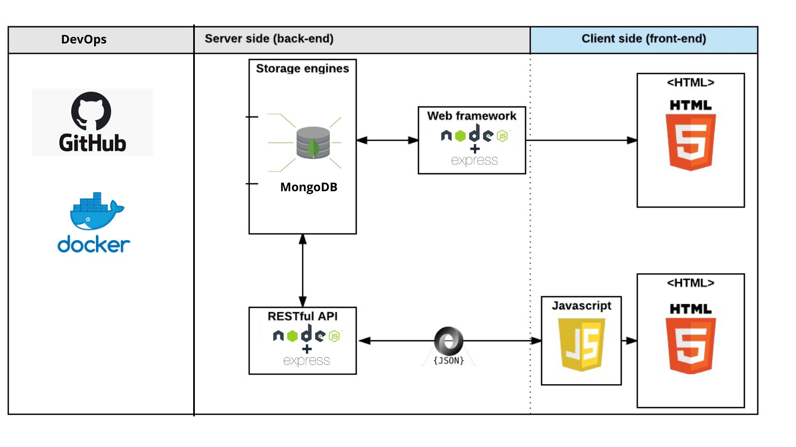

# Agroland
“Work the ground you want, while growing your dreams”

This project seeks to solve the difficulty of cultivation for people who do not have fertile land for the product, facilitating the reservation of temporary rent to carry out the cultivation.

This project does not solve the large income gap between the countryside and the city, the high costs of transportation in Colombia, the intermediation in the sales process, the inequality in productive capacities between small and medium producers also affect the competitiveness of farmers.

All these factors translate into high production costs that prevent them from competing in a market that is also suffering from exogenous or external shocks such as the coronavirus or climatic disasters.

# Architecture

# Infrastructure:

The branch strategy to be used will be the feature branching. This was chosen because it is ideal for short projects that require adjustments along the way. the merging strategy that will be used will be the minimal continuous integration implemented with Docker and Jenkins . This is due to the fact that a fundamental part of the project is the presentation at the predetermined time. For this reason, using an automatic tool for continuous integration, we can ensure at all times the operability of the various characteristics of our prototype.

Once the requirements and the architecture of the app are ready, the development of this will proceed by implementing and testing each feature of the app. To start up the server and carry out the tests, docker and jenkins will be used, and unit tests of each functionality of the app code will be carried out with the jest tool, which was chosen because it is one of the nodejs unit-tests frameworks easiest to start to use and one of the best documented

# Sourse Data
The data for development and tests were taken from the most recent cadastral registry of the IGAC and the registry of people of the Dane. It was decided to use data representative of the region to see how the app behaves with large volumes of real data.

